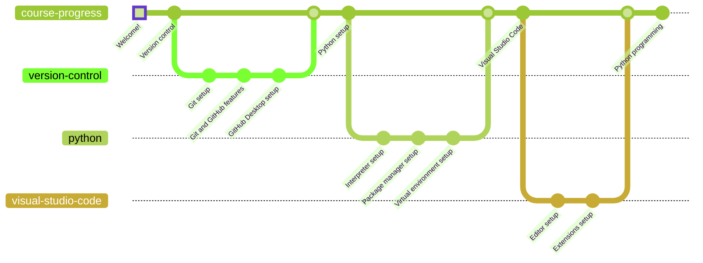

# Basic Formation Courses

Welcome to the Basic Formation Courses repository! This repository contains all the necessary resources to achieve a basic formation on common DevOps tools and practices, Python programming and good collaboration practices for development teams.

It is intended to be a foundation for collaborative development. It can be really useful for students that are starting their career in the industry. It does not intend to replace any official courses, yet it covers a set of topics that can be used as a kickstart for further learning.

## Structure

### Environment setup

This section covers the steps required to set up the collaborative environment for software development. It is divided into three subsections:

1. **Version control**: introduction to Git usage through the GitHub platform, as well as GitHub-specific tools for team collaboration.
   1. Git setup
   2. Git and GitHub features
   3. GitHub Desktop setup

2. **Python**: introduction to the language and component setup.
   1. Interpreter setup
   2. Package manager setup
   3. Virtual environment setup (future updates)

3. **Visual Studio Code**: introduction to the editor tool and component setup.
   1. Editor setup
   2. Extensions setup

### Python programming

This section covers topics related to Python programming from basic to intermediate level. It is divided into three subsections:

1. Standard **data types**, **control statements**, **functions** and **classes**
2. **Error handling** and **external libraries usage**
3. **Code stylization**

## Software specifications

Here are the specifications for the software tools used in this course:

| Software | Version | Windows support | macOS support | Linux support | Optional |
| :------: | :-----: | :-------------: | :-----------: | :-----------: | :------: |
| [Python](https://www.python.org/) | [3.11.2](https://www.python.org/downloads/release/python-3111/) | Yes | Yes | Yes | No |
| [Git](https://git-scm.com/) | 2.39.2+ | Yes | Yes | Yes | No |
| [GitHub Desktop](https://desktop.github.com/) | 3.1.6+ | Yes | Yes | Yes[^1] | Yes |
| [Visual Studio Code](https://code.visualstudio.com/) | [1.75.0+](https://code.visualstudio.com/Download) | Yes | Yes | Yes | Yes |

## How to follow the course?

The course is designed to cover several topics in a organized way. In order to do that, you only need to read a chapter until you reach the end, where you will find a link to the next one.

You are free to explore the repository as you wish, yet it is highly recommended to follow the course in the expected order, since not doing so might lead to confusion, configuration errors and other undetermined issues.

## Git

First off, let's start by installing Git as our version control software. You will find all the necessary instructions in [the next chapter](/docs/version-control/git/README.md).

---

## Disclaimer

**This course is intended to be used as a foundation for collaborative development. It is not intended to be a complete course on any of the topics covered. It is highly recommended to explore the topics covered in this course in more depth for further learning.**

**Contents covered by this course do not represent any official validation of the knowledge acquired by the students. The repository is an open-source tool for learning purposes only.**

**Suggestions over the contents of this course are welcome, yet it is not assured that all (or any) suggestions will be implemented. Feel free to open an issue or a pull request to suggest any change.**

**This repository is subject to the [GNU Affero General Public License v3](LICENSE). Feel free to explore its permissions and limitations at any time.**

[^1]: Linux support is not explicitely provided by GitHub, but it can be installed through [this repository](https://github.com/shiftkey/desktop/releases).
