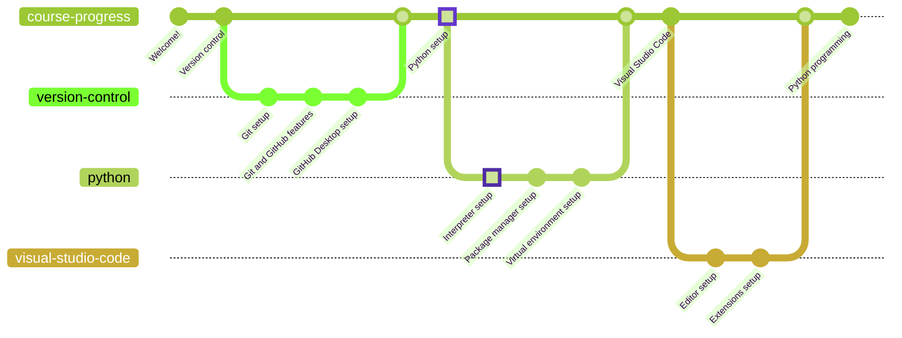
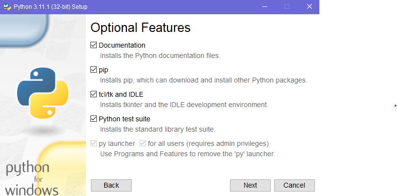

# Python



Python is a programming language that lets you work quickly and integrate systems more effectively. It is a high-level, interpreted, interactive and object-oriented scripting language. Python is designed to be highly readable. It uses English keywords frequently where as other languages use punctuation, and it has fewer syntactical constructions than other languages.

## Installation

### Source

There are plenty of Python versions, yet the 3.11.1 (latest) will be used for the tutorial.

| Operating system | Architecture | Installer |
| :--------------: | :----------: | :-------: |
| Windows          | x32          | [Download](https://www.python.org/ftp/python/3.11.1/python-3.11.1.exe) |
| Windows          | x64          | [Download](https://www.python.org/ftp/python/3.11.1/python-3.11.1-amd64.exe) |
| macOS            | -            | [Download](https://www.python.org/ftp/python/3.11.1/python-3.11.1-macos11.pkg) |
| Linux            | -            | [Package manager installation instructions](https://docs.python-guide.org/starting/install3/linux/) |

### Instructions

First of all, **do not install Python without customizing the process**. Check the "Add python.exe to PATH" box and click on "Customize installation".


Be sure to select all the optional features. They will include the documentation for the standard library, the Python package manager (`pip`), the graphical interface support (`tcl/tk`), and the Python development environment (`IDLE`). The test suite is not relevant for this matter, but install it as well. Click on "Next" to continue.



Check the Python file association and shortcut creation boxes. Also add the Python installation directory to the PATH environment variable. Standard library precompilation and debugging symbols are not explicitly required, but they are recommended. Click on "Install" to continue.


### Validation

In order to validate whether the installation worked, open a command line window pressing `Win + R` and typing `cmd`, then click "Enter". Type each one of the following commands until one of them prints the Python version (`Python 3.11.1`) on the screen:

```bash
python --version
py --version
python3 --version
```

Remember the command, since it is the keyword that points to the location of your Python executable. You will need it in the future.

If none of the commands work, head to the [troubleshooting](#troubleshooting) section and follow the instructions described there.

## Next up

- [Python packages](../packages/README.md)

---

## Troubleshooting

It is possible that none of the three installers works for you. Do not worry about it. There is a fourth option: the **source installation**. It is, however, significantly more complex for inexperienced users and thus, should only be used as a last resort in case none of the installers work.

A powerful feature of the source installation is that it can be perfomed in a completely portable manner, without requiring administrative privileges nor causing significant changes to the system.

### Source Installation

Prior to installation, the file must be decompressed. This can be achieved through a command line window or a graphical file manager. The following commands are for the command line:

```bash
# Be sure to be in the directory where the file is located.
tar -xzf Python-3.11.1.tgz
cd Python-3.11.1
```

If using a graphical file manager, just extract the file and navigate to the directory using the command line interface.

### Windows

Navigate to the `PCBuild` directory and execute the `build.bat` file. This will build the Python executable and place it in the `PCBuild` directory. No extra configuration is required for now.

After the installation is done, the Python executable will be located in the same directory where the `build.bat` file is located, under the `amd64` directory. The executable is named `python.exe`.
