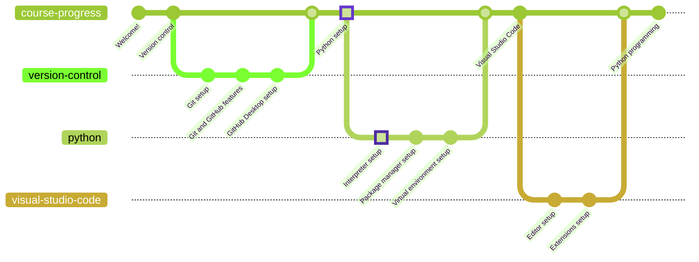

# Python



Python is a programming language that lets you work quickly and integrate systems more effectively. It is a high-level, interpreted, interactive and object-oriented scripting language. Python is designed to be highly readable. It uses English keywords frequently where as other languages use punctuation, and it has fewer syntactical constructions than other languages.

There are plenty of Python versions, yet the 3.11.2 will be used for the tutorial.

## Download

* [Windows x64 (direct download)](https://www.python.org/ftp/python/3.11.2/python-3.11.2-amd64.exe)
* [Other downloads](https://www.python.org/downloads/release/python-3112/)

## Installation

First of all, **do not install Python without customizing the process**. Check the "Add python.exe to PATH" box and click on "Customize installation".


Be sure to select all the optional features. They will include the documentation for the standard library, the Python package manager (`pip`), the graphical interface support (`tcl/tk`), and the Python development environment (`IDLE`). The test suite is not relevant for this matter, but install it as well. Click on "Next" to continue.


Check the Python file association and shortcut creation boxes. Also add the Python installation directory to the PATH environment variable. Standard library precompilation and debugging symbols are not explicitly required, but they are recommended. Click on "Install" to continue.


### Validation

You can check whether Python is installed using the `python` command:

```powershell
python --version
>>> Python 3.11.2
```

If this command returns an error, it either means that Python was not installed successfully or that the `python` command is not linked to the program.

## Python packages

The Python language relies on collaborative development for additional functionality, which is manifested in the form of packages. You will learn about package installation in [the next chapter](../packages/README.md).

If you want to go back to [the previous chapter](/docs/version-control/github-desktop/README.md), go ahead!
