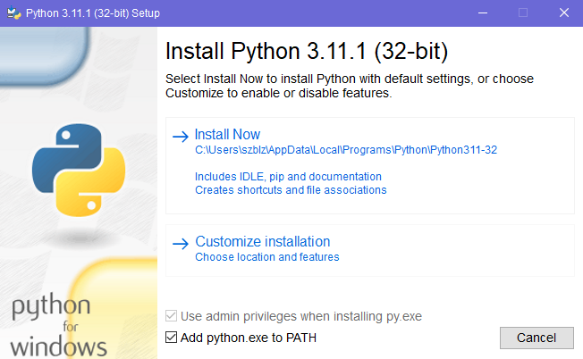
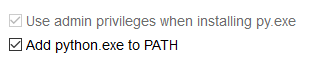
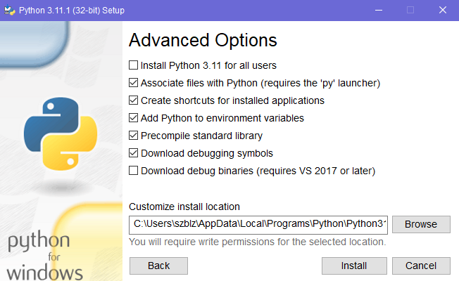

# Python Installation

This tutorial will guide you through the process of installing Python on your computer. Python is a programming language that is used to create web applications, data science applications, and more. It is a very popular language and is used by many companies and organizations.

## Operating Systems

The only operating system that will be covered in this tutorial is Windows. If you are using a different operating system, you can find the installation instructions for your operating system [here](https://www.python.org/downloads/).

## Python Versions

There are plenty of Python versions, yet the 3.11.1 (latest) will be used for the tutorial.

## Installation

Three Python executable installers are provided in this tutorial: [32-bit version](python-3.11.1.exe), [64-bit version](python-3.11.1-amd64.exe), and [ARM64](python-3.11.1-arm64.exe). The 32-bit version is for 32-bit Windows, the 64-bit version is for 64-bit Windows, and the ARM64 version is for Windows on ARM. Try to install the 64-bit version if you are on a 64-bit Windows. If it is not supported by your computer (which is highly unlikely), try any of the other two versions.

**Installation steps:**

First of all, **do not install Python without customizing the process**. Check the "Add python.exe to PATH" box and click on "Customize installation".





Be sure to select all the optional features. They will include the documentation for the standard library, the Python package manager (`pip`), the graphical interface support (`tcl/tk`), and the Python development environment (`IDLE`). The test suite is not relevant for this matter, but install it as well. Click on "Next" to continue.


Check the Python file association and shortcut creation boxes. Also add the Python installation directory to the PATH environment variable. Standard library precompilation and debugging symbols are not explicitly required, but they are recommended. Click on "Install" to continue.



## Validation

In order to validate whether the installation worked, open a command line window pressing `Win + R` and typing `cmd`, then click "Enter". Type each one of the following commands until one of them prints the Python version (`Python 3.11.1`) on the screen:

```bash
python --version
py --version
python3 --version
```

Remember the command, since it is the keyword that points to the location of your Python executable. You will need it in the future.

If none of the commands work, head to the [troubleshooting](#troubleshooting) section and follow the instructions described there.

## Troubleshooting

It is possible that none of the three installers works for you. Do not worry about it. There is a fourth option: the [source installation](../source/README.md). It is a more complex process, but it is highly customizable and OS-independent. It is, however, significantly more complex for inexperienced users and thus, should only be used as a last resort in case none of the installers work.

## Next Steps

Now that Python is installed, you can proceed to the [Packages](../../packages/README.md) tutorial.

You can also find the documentation for the standard library [here](https://docs.python.org/3.11/).
