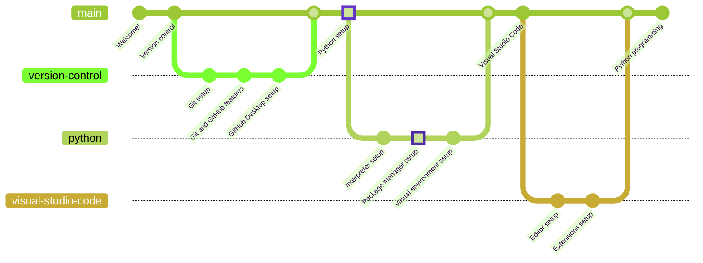

# Python Packages Installation

> ***Estimated completion time: 10 minutes***



Python packages are a collection of modules that extend the functionality of the language. They are usually installed using the default package manager, named `pip` (*Preferred Installer Program*) and are available on the [Python Package Index](https://pypi.org/). For example, take a look at the amazing [bidimensional](https://pypi.org/project/bidimensional/) package that provides a set of tools to work with bidimensional data.

Many packages are already part of the **standard library** (the collection of default modules that are installed along with Python), but there are many, many others that have to be installed manually.

Learning to install packages, resolve their installation and versioning issues and even developing them are key skills for any Python developer.

## Installation

You can check whether `pip` is installed using the following command:

```bash
python -m pip --version
```

If it returns an error, `pip` is not installed. If it returns a numeric sequence, that means you have got said `pip` version installed.

In a scenario where `pip` is not installed, there's no need to worry, since Python provides with [a couple fallback installation methods](https://pip.pypa.io/en/stable/installation/#supported-methods), such as `ensurepip`, which ensures `pip` installation using a simple command:

```bash
python -m ensurepip --upgrade
```

### Common `pip` usage issue

It is possible to invoke `pip` directly, yet I strongly disencourage this practice. Note the difference between these two commands:

```bash
python -m pip --version
pip --version
```

They seem alike enough, but a very common scenario is the one where the `python` command points at, let's say, the Python 3.9 installation, while the `pip` command points at the `pip` package of the Python 3.10 installation.

Since different Python versions do not share installed packages, the usage of `pip` can easily cause simple but hard to identify issues (specially for beginners).

## Elemental commands

There are a few commands that should be known to any Python user:

* `pip install <package>`: installs a package (i.e. `python -m pip install matplotlib`).
  * `pip install --upgrade <package>`: installs and upgrades a package (i.e. `python -m pip install --upgrade bidimensional`).
  * `pip install -r <requirements file>`: installs all packages specified in a requirements file (i.e. `python -m pip install -r requirements.txt`). *Take a look at a sample [requirements file](/requirements/requirements.txt) for Python development.*
* `pip uninstall <package>`: uninstalls a package (i.e. `python -m pip uninstall matplotlib`).
* `pip list`: displays all currently installed packages and versions.

### Getting all versions of a package

There is a particular trick to determine all available versions of a specific package:

```bash
# Generic example:
python -m pip install <package>==

# Specific example:
python -m pip install numpy==
```

The last command will return an error:

```bash
ERROR: Ignored the following versions that require a different python version: 1.21.2 Requires-Python >=3.7,<3.11; 1.21.3 Requires-Python >=3.7,<3.11; 1.21.4 Requires-Python >=3.7,<3.11; 1.21.5 Requires-Python >=3.7,<3.11; 1.21.6 Requires-Python >=3.7,<3.11
ERROR: Could not find a version that satisfies the requirement numpy== (from versions: 1.3.0, 1.4.1, 1.5.0, 1.5.1, 1.6.0, 1.6.1, 1.6.2, 1.7.0, 1.7.1, 1.7.2, 1.8.0, 1.8.1, 1.8.2, 1.9.0, 1.9.1, 1.9.2, 1.9.3, 1.10.0.post2, 1.10.1, 1.10.2, 1.10.4, 1.11.0, 1.11.1, 1.11.2, 1.11.3, 1.12.0, 1.12.1, 1.13.0, 1.13.1, 1.13.3, 1.14.0, 1.14.1, 1.14.2, 1.14.3, 1.14.4, 1.14.5, 1.14.6, 1.15.0, 1.15.1, 1.15.2, 1.15.3, 1.15.4, 1.16.0, 1.16.1, 1.16.2, 1.16.3, 1.16.4, 1.16.5, 1.16.6, 1.17.0, 1.17.1, 1.17.2, 1.17.3, 1.17.4, 1.17.5, 1.18.0, 1.18.1, 1.18.2, 1.18.3, 1.18.4, 1.18.5, 1.19.0, 1.19.1, 1.19.2, 1.19.3, 1.19.4, 1.19.5, 1.20.0, 1.20.1, 1.20.2, 1.20.3, 1.21.0, 1.21.1, 1.22.0, 1.22.1, 1.22.2, 1.22.3, 1.22.4, 1.23.0rc1, 1.23.0rc2, 1.23.0rc3, 1.23.0, 1.23.1, 1.23.2, 1.23.3, 1.23.4, 1.23.5, 1.24.0rc1, 1.24.0rc2, 1.24.0, 1.24.1, 1.24.2)
ERROR: No matching distribution found for numpy==
```

The relevant part here is in the second line, which contains a list of all available versions for a package in the current Python interpreter version.

## Visual Studio Code

Visual Studio Code is a very popular code editor, and it has a very good support for Python. You will learn how to installed and configure it in [**the next chapter**](/docs/visual-studio-code/editor/README.md).

If you want to go back to [the previous chapter](../interpreter/README.md), go ahead!
