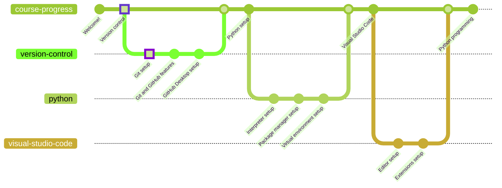

# Git

Git is a free and open source distributed version control system designed to handle everything from small to very large projects with speed and efficiency.

## Installation

| Operating system | Architecture | Portable | Installer |
| :--------------: | :----------: | :------: | :-------: |
| Windows          | x32          | No       | [Download](https://github.com/git-for-windows/git/releases/download/v2.39.1.windows.1/Git-2.39.1-32-bit.exe) |
| Windows          | x32          | Yes      | [Download](https://github.com/git-for-windows/git/releases/download/v2.39.1.windows.1/Git-2.39.1-64-bit.exe) |
| Windows          | x64          | No       | [Download](https://github.com/git-for-windows/git/releases/download/v2.39.1.windows.1/PortableGit-2.39.1-32-bit.7z.exe) |
| Windows          | x64          | Yes      | [Download](https://github.com/git-for-windows/git/releases/download/v2.39.1.windows.1/PortableGit-2.39.1-64-bit.7z.exe) |
| macOS            | -            | -        | [Package manager installation instructions](https://git-scm.com/download/mac) |
| Linux            | -            | -        | [Package manager installation instructions](https://git-scm.com/download/linux) |

## Installation Instructions

In order to install Git, it is only necessary to follow the installer procedure. There are plenty of customization options that can be explored, but for this course it is recommended to use default settings.

## Next steps

- [Return to the GitHub tutorial](../github/README.md#repositories-git)
