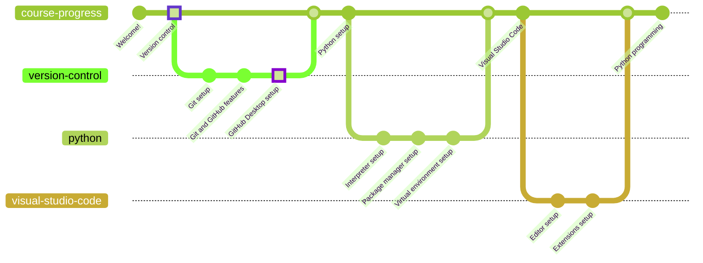

# GitHub Desktop

GitHub Desktop is the application interface for GitHub Web. It allows a more direct interaction between the user and GitHub/Git features that are available on the web.

I personally recommend its usage, specially for beginners, since it makes working with the interface an easy task. Using Git directly might be the cause for plenty of difficulties, yet advanced users are more than welcome to use it.

## Download

* [Windows x64 (direct download)](https://central.github.com/deployments/desktop/desktop/latest/win32)
* [Other downloads](https://desktop.github.com/)

## Installation

In order to install GitHub Desktop you only need to run the installer and add your profile configuration (your name and email). Furthermore, you might need to log in with your GitHub account in order to be able to access your remote repositories.

### Validation

You can make sure the installation was successful by searching for "GitHub Desktop" in the list of installed applications.

## Python

Python is a versatile programming language that is used in a wide variety of fields, such as web development, data science, machine learning, and many others. You will learn how to install and use it in [the next chapter](/docs/python/interpreter/README.md).

If you want to go back to [the previous chapter](../github/README.md), go ahead!