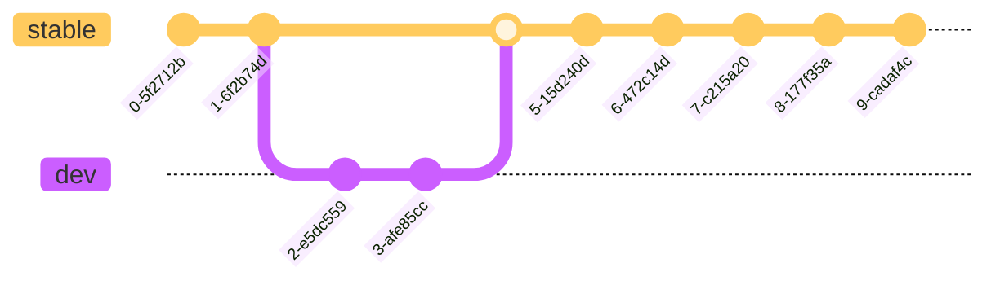

# GitHub

GitHub is an excellent collaboration tool for development teams and a great way to share your code with the world. It is also a great way to learn how to use Git, since it is the most popular Git repository hosting service.

The platform is based on the core functionality of the Git version control system, but it is not the same as Git itself. GitHub is just an interface. Do not forget that. However, it is easier to learn Git by using GitHub, since it provides a graphical interface to perform most of the Git operations, which would be performed over the command line otherwise.

*In order to avoid confusion, all features described in this document are followed by a reference to the software tool that implements them (Git, GitHub).*

First of all, take a look at [this article](https://blogs.motiondevelopment.top/blog/posts/git-and-github), which describes perfectly what this course is all about.

## Repositories (Git)

A repository is the home for your code. It can be **public** or **private**, and it can contain as many files as you want (of course, with some limitations, such as individual file size and total repository size). It can also contain directories, which are used to organize said files.

## Commits (Git)

A commit represents **a modification or set of modifications** performed in a repository. It is the basic unit of change in Git, and it is used to **track the contribution history** of a repository. A commit always contains a **commit message**, which is a short description of the changes made, and the actual changes themselves. Additionally, it can contain another message, which is used as extended description when it is required.

## Branches (Git)

Branches are **parallel versions of a given state of a repository**. They are the key to collaborative development, since **they allow multiple developers to work on the same repository without affecting each other**. Branches are created from a given commit in another branch, and they can be merged back into the original branch when the work is done.

A **main branch** is always present on every repository, since if there were no branches, no commits could be made. This branch is called `master` by default, but it can be renamed to any other name. This is a good practice to avoid using the default name, since [it can be considered offensive for some people](https://www.theserverside.com/feature/Why-GitHub-renamed-its-master-branch-to-main).

A common combination of branches are the `stable`-`dev` couple, which represent both stable versions of the repository and in-development versions, respectively.

Commits are named using [**hashes**](https://medium.com/@jonathan_finch/git-commit-hash-number-theory-770f67ec492d) in order to generate a **unique identification** for each one of them.

Here is an example of a more complex branch system, such as the one used for an Autonomous System development:

## Forks (Git)

Forks are **copies of a repository**. They are used to generate a fresh replica of a given state of the repository for your own purposes, so that **you can change it without affecting the original repository**. This is a great way to contribute to open-source projects, or even to create your own version of a project and develop it independently.

Any repository can be forked as long as the user has access to it. Forking a repository is as simple as clicking the "Fork" button in the top-right corner of the repository page.

Clicking that button will cause a new window to open, asking for details on how to fork the repository. The default options are usually fine, but you can change them if you want. Note that you cannot fork a repository into the same account it belongs to.

The *"Copy only the `stable` branch only"* option can be used to only fork the main branch of the repository, in this case, named `stable`. This is useful in case the repository has multiple branches, and you only want to fork the most relevant one.

## Merge Requests and Merge Conflicts (Git)

A merge request is a **low-level petition to merge a branch into another one**. A merge request is composed of a **base branch** and a **source one**. The base branch is the one that will **receive the changes**, while the source branch is the one that **will be merged into the base branch**.

The low-level nature of merge requests is due to the fact that their objective is to determine whether or not the changes present in each branch are compatible, that is, whether the **lines** of the files that have been modified share the same state. You might wonder why this would be a problem, so let's take a look at an example:

1. There are two branches, `A` and `B`.
2. There are two developers, `X` and `Y`.
3. `X` commits changes to the `A` branch, while `Y` commits changes to the `B` branch.
4. `X` modifies `File1` in the `A` branch, while `Y` modifies `File1` in the `B` branch.
5. `Y` attempts to merge the `B` branch into the `A` branch.
6. Which version of the file should be used? The one from `X` or the one from `Y`?

Note that this issue is not trivial, since `X` could have modified `File1` **after** `Y` did, but `Y` requested a merge after `X` performed the modification, so the last modification of `File1` does not match the last modification on the repository (new changes are overwritten).

When this happens, a **merge conflict** is generated. This is a situation in which the changes present in the source branch cannot be merged into the base branch, since they are incompatible. This is a very common situation, and it is important to know how to deal with it. Fortunately, Git provides with a simple solution to this problem: when a merge conflict is detected, the merge request is halted and the user is prompted to solve the conflict. This is done by modifying the conflicting file or files in order to make them compatible with the base branch.

### Merge Strategies (Git)

There are three main ways to merge branches in Git, each one with its own advantages and disadvantages.

| Strategy | Linear history | Prioritizes most recent changes |
| -------- | :------------: | :-----------------------------: |
| Standard | No             | No                              |
| Squash   | Yes            | No                              |
| Rebase   | Yes            | Yes                             |

Let's consider the following (conflictless) scenario in order to study the differences between strategies:

#### Standard (Merge)

This is the default strategy. **It mixes commits on the timeline**, which means that commits on both branches will preserve their original order.

Although this strategy is the most common one, it might cause the commit log to be hard to understand, since multiple commits will suddenly appear on the base branch history in a non-linear order.

#### Squash

This strategy **does not mix commits on the timeline**, which means that commits on the base branch will keep their linearity.

Furthermore, this strategy combines all the commits on the source branch into a single one, which is later merged into the base branch. This greatly simplifies the understanding of the commit log.

#### Rebase

This strategy **does not mix commits on the timeline**, which means that commits on the base branch will keep their linearity.

This strategy is not commonly used, since it mixes parts of both the standard and squash ones. It adds all the commits from the source branch to the base branch in their particular order (not combined), but sets them as the most recent on the base branch.

## Pull Requests (Git, GitHub)

A pull request (PR) is a **petition to merge a branch into another branch when the user does not have sufficient rights to commit directly to said branch**. They can be used to create a halted state between development and implementation, which is useful when there are lots of changes that require exhaustive revisions. Automatic actions can also halt the PR process in order to automatically verify that new changes are properly implemented.

PRs are listed in the pull request tab of a repository:

New PRs can be created clicking the *"New Pull Request"* button. After that, a new window will open:

They key information in this window is the bar that shows which branches are being compared, as well as whether they can be automatically merged. Note how it depicts both **base** and **compare (source)** branches, with a very descriptive arrow that indicates the direction of the changes.

We will take a deeper look at PRs after [Actions](#actions-github) have been explained.

## Issues (GitHub)

Issues are the **standard method of problem report, enhancement proposal or simple organization tool**. They are petitions that can be created using the issues' interface:

In order to create a new issue, just click the big, green *"New issue"* button. A new interface will pop up:

The issue is composed of a **title** and a **description**. It is important to be clear while writing requests in these fields, since they have to be understandable to the rest of developers.

Furthermore, there is a sidebar with multiple options on the right side of the screen:

All these fields have got a meaning:

- **Assignees**: the set of people assigned to the resolution of the issue.
- **Labels**: additional classifiers for the issue.
- **Projects**: organization schemas that include the issue.
- **Milestone**: development goal that the issue contributes to.
- **Development**: list of linked PRs that aim to resolve the issue.

## Projects (GitHub)

Projects are a very useful tool for collaborative (and even individual) development, since **they help organize a set of issues and/or PRs in order to plan the evolution of a project**.

Projects can be created directly from your GitHub profile, and can later be linked to one or more repositories. Here is an example of a release schedule for multiple repositories:

As you can see, there are multiple ways to organize information in Projects, which can aid developing by adding clarity over the tasks that have to be done.

## Discussions (GitHub)

Discussions are, essentially, **forums for the developers of a project**. They can be used to discuss polemic issues in which many people want to express their opinion, brainstorming, tutorials... anything you can imagine.

They can be accessed through the tabs of most repositories:

A very good example of what Discussions are useful for is the Q&A system:

Furthermore, they can be used to pin tutorials for some specific functionalities that are implemented in the repository:

## Actions (GitHub)

Actions are **the key for project automation and constant development**. They are scripts of code that are executed upon specific events during the development process (i.e. a commit that has been pushed, a branch that has been merged...).

There is no need to dive into the complexity of actions in this course, since it would be excessively long. Let's just take a look at the Actions interface:

Each green/red dot represents an executed workflow, which is a script that contains a set of instructions to be executed remotely. These instructions can either pass or fail

This functionality can be used for automatic PR revisions, for example, by implementing a workflow that tests your program against multiple versions of a language. If the workflow fails, you will not be allowed to merge the PR until you fix the changes.

## Pages and Wikis (GitHub)

[Pages](https://pages.github.com/) and [Wikis](https://docs.github.com/en/communities/documenting-your-project-with-wikis/about-wikis) are presentation tools for the repository. They can hold an interface for the project and all the required documents that explain how to use it.

These functionalities will not be covered in this course since they are not *absolutely* relevant, but they can be interesting to explore on your own, so feel free to do so!

## GitHub Setup

You will need to create a GitHub account in order to fully explore this course and all the possibilities that GitHub has to offer. Do it in [the next chapter](./SETUP.md).

If you want to go back to [the previous chapter](../git/README.md), go ahead!
