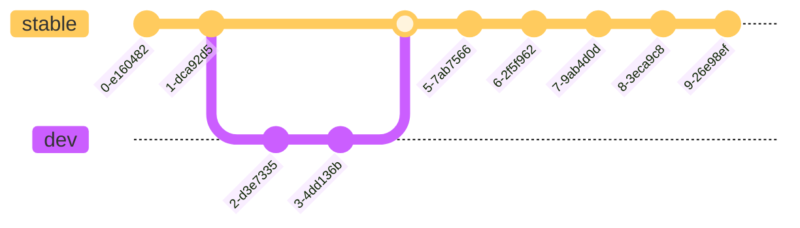

---

 

    

 

---

# GitHub

GitHub is an excellent collaboration tool for development teams and a great way to share your code with the world. It is also a great way to learn how to use Git, since it is the most popular Git repository hosting service.

The platform is based on the core functionality of the Git version control system, but it is not the same as Git itself. GitHub is just an interface. Do not forget that.

However, it is easier to learn Git by using GitHub, since it provides a graphical interface to perform most of the Git operations, which would be performed over the command line otherwise.

*All features in this document are followed by a reference to the software tool that implements them (Git, GitHub).*

Before diving into the contents of Git and GitHub, go to the [Git installation page](../git/README.md) and proceed with the installation.

## Repositories (Git)

A repository is the home for your code. It can be public or private, and it can contain as many files as you want (of course, with some limitations, such as individual file size and total repository size). It can also contain directories, which are used to organize said files.

## Commits (Git)

A commit represents any modification or set of modifications over a repository. It is the basic unit of change in Git, and it is used to track the history of a repository. A commit is made up of a commit message, which is a short description of the changes made, and the actual changes themselves.

## Branches (Git)

Branches are parallel versions of a given state of a repository. They are the key to collaborative development, since they allow multiple developers to work on the same repository without affecting each other. Branches are created from a given commit in another branch, and they can be merged back into the original branch when the work is done.

A main branch is always present on the repository, since if there were no branches, no commits could be made. This branch is called `master` by default, but it can be renamed to any other name. This is a good practice to avoid using the default name, since [it can be considered offensive for some people](https://www.theserverside.com/feature/Why-GitHub-renamed-its-master-branch-to-main).

Commits are named using hashes in order to generate a unique identification for each one of them.

It is also a good practice to have multiple branches such as `stable` and `dev`. The first one is used for stable code releases, while the second is used for development practices. This way, the stable branch is always ready for production, while the development branch is used to test new features and bug fixes.

## Forks (Git)

A fork is a copy of a repository. It is used to create a copy of a repository in your own account, so you can make changes to it without affecting the original repository. This is a great way to contribute to open-source projects, or even to create your own version of a project.

Any repository can be forked as long as the user has access to it. Forking a repository is as simple as clicking the "Fork" button in the top-right corner of the repository page.

Clicking that button will cause a new window to open, asking for details on how to fork the repository. The default options are usually fine, but you can change them if you want. Note that you cannot fork a repository into the same account it belongs to.

The *"Copy only the `<branch>` branch only"* option can be used to only fork the main branch of the repository. This is useful in case the repository has multiple branches, and you only want to fork the stable one.

## Merge Requests (Git)

A merge request is a **low-level** petition to merge a branch into another one. A merge request is composed of a **base** branch and a **source** one. The base branch is the one that will receive the changes, while the source branch is the one that will be merged into the base branch.

The low-level nature of merge requests is due to the fact that their objective is to determine whether or not the changes present in each branch are compatible, that is, whether the **lines** of the files that have been modified share the same state. You might wonder why this would be a problem, so let's take a look at an example:

1. There are two branches, `A` and `B`.
2. There are two developers, `X` and `Y`.
3. `X` commits changes to the `A` branch, while `Y` commits changes to the `B` branch.
4. `X` modifies `File1` in the `A` branch, while `Y` modifies `File1` in the `B` branch.
5. `Y` attempts to merge the `B` branch into the `A` branch.
6. Which version of the file should be used? The one from `X` or the one from `Y`?

Note that this issue is not trivial, since `X` could have modified `File1` **after** `Y` did, but `Y` requested a merge after `X` performed the modification, so the last modification of `File1` does not match the last modification on the repository (new changes are overwritten).

When this happens, a **merge conflict** is generated. This is a situation in which the changes present in the source branch cannot be merged into the base branch, since they are incompatible. This is a very common situation, and it is important to know how to deal with it. Fortunately, Git provides with a simple solution to this problem: when a merge conflict is detected, the merge request is halted and the user is prompted to solve the conflict. This is done by modifying the conflicting file or files in order to make them compatible with the base branch.

### Merge Strategies (Git)

There are three main ways to merge branches in Git, each one with its own advantages and disadvantages.

| Strategy | Linear history | Prioritizes most recent changes |
| -------- | :------------: | :-----------------------------: |
| Standard | Yes            | No                              |
| Squash   | No             | No                              |
| Rebase   | No             | Yes                             |

Let's consider the following (conflictless) scenario:

#### Standard (Merge)

This is the default strategy. **It mixes commits on the timeline**, which means that commits on both branches will preserve their original order.

Although this strategy is the most common one, it might cause the commit log to be hard to understand, since multiple commits will suddenly appear on the base branch history in a non-linear order.

#### Squash

This strategy **does not mix commits on the timeline**, which means that commits on the base branch will keep their linearity.

Furthermore, this strategy combines all the commits on the source branch into a single one, which is later merged into the base branch. This greatly simplifies the understanding of the commit log.

#### Rebase

This strategy **does not mix commits on the timeline**, which means that commits on the base branch will keep their linearity.

This strategy is not commonly used, since it mixes parts of both the standard and squash ones. It adds all the commits from the source branch to the base branch in their particular order (not combined), but sets them as the most recent on the base branch.

## Pull Requests (Git, GitHub)

A pull request (PR) is a petition to merge a branch into another branch when the user does not have sufficient rights to commit directly to said branch

New PRs can be created using the *"New Pull Request"* button. After that, a new window will open:

They key information in this window is the bar that shows which branches are being compared, as well as whether they can be automatically merged:

These three concepts must be understood clearly in order to learn how to use pull requests:

- **Base**: The branch that will **receive** the changes.
- **Compare**: The branch that will **send** the changes.
- **Ability to merge**: Whether the changes can be merged automatically or not.

This last condition might raise doubts,

Pull requests have got some key features that make them a indispensable tool for collaborative development:

- They allow the user to review the changes before merging them into the target branch.
- They allow the user to request changes to the changes before merging them into the target branch.
- They allow automatic checks to be run on the changes before merging them into the target branch.

## Issues (GitHub)

## Projects (GitHub)

## Discussions (GitHub)

## Actions (GitHub)

## Pages (GitHub)

## Wikis (GitHub)
