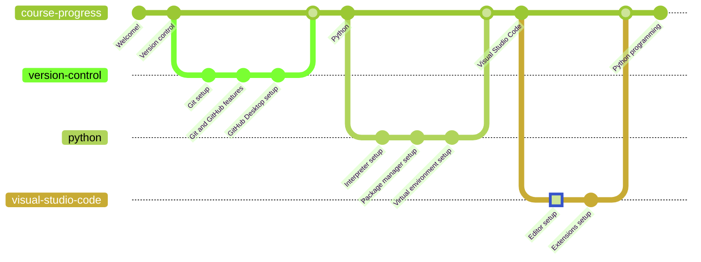

# Visual Studio Code Installation

Visual Studio Code (VSC) is a relatively lightweight editor (not IDE) for code development. It is highly versatile and has got support for almost all platforms. It is open source and can be built from scratch, but for the sake of this course, we will be installing it using an installer binary.

## Download

* [Windows x64 (direct download)](https://az764295.vo.msecnd.net/stable/441438abd1ac652551dbe4d408dfcec8a499b8bf/VSCodeUserSetup-x64-1.75.1.exe)
* [Other downloads](https://code.visualstudio.com/download#)

## Installation

The installation steps are as simple as they get. Just follow the installer instructions and you will be good to go.

Make sure to check the options that suggest adding VSC explorer integration. This will allow you to right-click on a directory and be able to open it with VSC, which is always useful.

## Configuration

Configuring VSC can either be easy or insanely hard. This is due to the immense amount of configuration options that if supports.

Almost everything is customizable, from keyboard shortcuts to automated task procedures.

