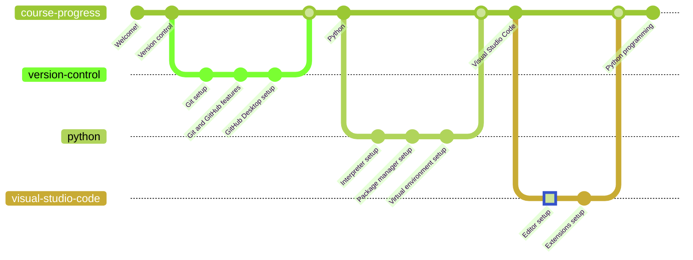

# Visual Studio Code Installation

```mermaid
%%{
    init: {
        'logLevel': 'debug',
        'theme': 'forest',
        'gitGraph': {
            'showBranches': true,
            'showCommitLabel':true,
            'mainBranchName': 'course-progress'
        }
    }
}%%

gitGraph
   commit id: "Welcome!"

   commit id: "Version control"
   branch version-control
   checkout version-control
   commit id: "Git setup"
   commit id: "Git and GitHub features"
   commit id: "GitHub Desktop setup"
   checkout course-progress
   merge version-control

   commit id: "Python"
   branch python
   checkout python
   commit id: "Interpreter setup"
   commit id: "Package manager setup"
   commit id: "Virtual environment setup"
   checkout course-progress
   merge python

   commit id: "Visual Studio Code"
   branch visual-studio-code
   checkout visual-studio-code
   commit id: "Editor setup" type: HIGHLIGHT
   commit id: "Extensions setup"
   checkout course-progress
   merge visual-studio-code

   commit id: "Python programming"
```
