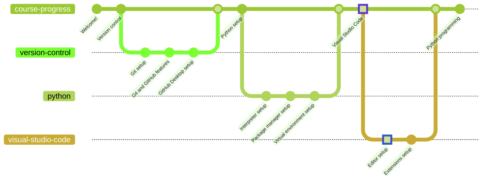

# Visual Studio Code Installation

Visual Studio Code (VSC) is a relatively lightweight editor (not IDE) for code development. It is highly versatile and has got support for almost all platforms. It is open source and can be built from scratch, but for the sake of this course, we will be installing it using an installer binary.

## Download

* [Windows x64 (direct download)](https://az764295.vo.msecnd.net/stable/441438abd1ac652551dbe4d408dfcec8a499b8bf/VSCodeUserSetup-x64-1.75.1.exe)
* [Other downloads](https://code.visualstudio.com/download#)

## Installation

The installation steps are as simple as they get. Just follow the installer instructions and you will be good to go.

Make sure to check the options that suggest adding VSC explorer integration. This will allow you to right-click on a directory and be able to open it with VSC, which is always useful.

## Configuration

Configuring VSC can either be easy or insanely hard. This is due to the immense amount of configuration options that if supports.

Almost everything is customizable, from keyboard shortcuts to automated task procedures. Furthermore, as of January 2023, VSC supports multiple profiles, which means that you will be able to customize a profile specifically for an operating system or development environment.

### Global Vs. Local configuration

VSC supports multiple configuration scopes. The global configuration contains, for example, the user's keyboard shortcuts. On the other hand, a local configuration contains workspace-specific task definitions, editor options, etc.

Note that local configuration has precedence over the global one, since it is more specific. Said configuration stores its parameters in a file named `.vscode/settings.json`, which is automatically created in a workspace when any setting is configured.

Unless it is your responsibility to configure the workspace, you should not be worried about configurations, since VSC loads them automatically depending on the current workspace and global configuration. Just make sure not to edit them by mistake while you are adjusting your settings.

## Extensions

Extensions are the heart of the VSC community. There are millions of extensions that add non-native support for external platforms and languages (GitHub, Node, Python...) or useful tools (Linters, Themes, Testers...).

You will learn how to install extensions in [the next chapter](../extensions/README.md).

If you want to go back to [the previous chapter](/docs/python/packages/README.md), go ahead!