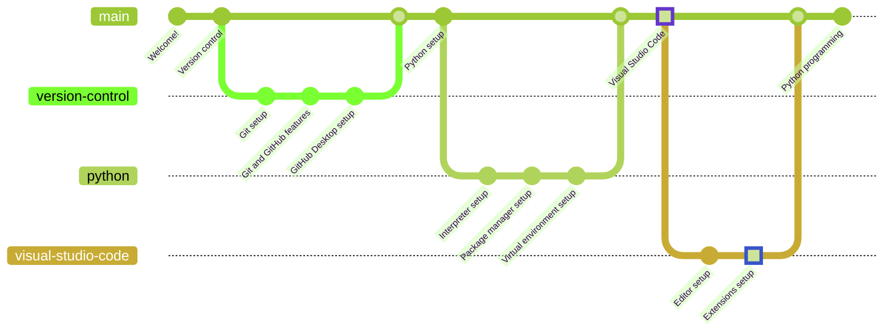

# Visual Studio Code Extensions

## VSCode Profiles

Since profiles are now supported, there is no need to install all extensions separately, a single profile can be imported with all the required extensions. I will provide you with two profiles dedicated to Python. Both include all extensions, but the first one also adds keyboard shortcuts, a custom theme and a few other interesting settings. If you already have a custom VSCode profile, no need to replace your beloved themes and settings with mine, just import the second profile.

- Extensions, theme and settings: `https://gist.github.com/erlete/91ebeeeccfe686b7ddfe4465ecd590fa`
- Extensions alone: `https://gist.github.com/erlete/3a9cb57dc3bb95ed8a8e209188e329d9`

### Import the profile

In order to import the profile, press `Ctrl + Shift + P`, which will open up the command palette. Write *"Profiles: Import Profile..."* and press `Enter`. Now paste one of the URLs above and press enter again. The sidebar will display the import settings. Now click *"Import Profile"* and you are all done!

### Activating the profile

In order to activate the profile, click the gear icon on the lower left side of the screen. Select *"Profiles"* and click on *"Python (Windows)"*. Now wait for all the extensions to load up, which might take a while depending on the quality of your internet connection and the R/W speed of your computer.

## Python Programming

As of now, you are all set to start learning Python programming. You will now understand how lessons are structured through [the introduction guide](/lessons/README.md).

If you want to go back to [the previous chapter](../editor/README.md), go ahead!
