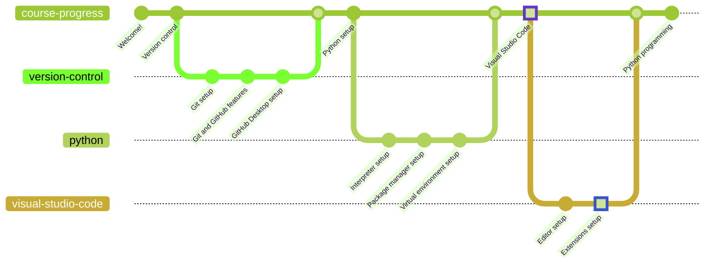

# Visual Studio Code Extensions

## Markdown

**Name: GitHub Markdown Preview**
Id: bierner.github-markdown-preview
Description: Changes VS Code's built-in markdown preview to match GitHub
Version: 0.3.0
Publisher: Matt Bierner

[Click here to download](https://marketplace.visualstudio.com/items?itemName=bierner.github-markdown-preview)

## Jupyter Notebooks

**Name: Jupyter**
Id: ms-toolsai.jupyter
Description: Jupyter notebook support, interactive programming and computing that supports Intellisense, debugging and more.
Version: 2022.11.1003412109
Publisher: Microsoft

[Click here to download](https://marketplace.visualstudio.com/items?itemName=ms-toolsai.jupyter)

## Python

**Name: Python Extension Pack**
Id: donjayamanne.python-extension-pack
Description: Popular Visual Studio Code extensions for Python
Version: 1.7.0
Publisher: Don Jayamanne

[Click here to download](https://marketplace.visualstudio.com/items?itemName=donjayamanne.python-extension-pack)

**Name: Pylance**
Id: ms-python.vscode-pylance
Description: A performant, feature-rich language server for Python in VS Code
Version: 2023.1.40
Publisher: Microsoft

[Click here to download](https://marketplace.visualstudio.com/items?itemName=ms-python.vscode-pylance)

**Name: isort**
Id: ms-python.isort
Description: Import Organization support for Python files using `isort`.
Version: 2022.8.0
Publisher: Microsoft

[Click here to download](https://marketplace.visualstudio.com/items?itemName=ms-python.isort)

**Name: SonarLint**
Id: SonarSource.sonarlint-vscode
Description: SonarLint is an IDE extension that helps you detect and fix quality issues as you write code in C, C++, Java, JavaScript, PHP, Python, HTML and TypeScript.
Version: 3.13.0
Publisher: SonarSource

[Click here to download](https://marketplace.visualstudio.com/items?itemName=SonarSource.sonarlint-vscode)

## Python Programming

As of now, you are all set to start learning Python programming. Go ahead and dive into [the first lesson](/lessons/introduction.ipynb).

If you want to go back to [the previous chapter](../editor/README.md), go ahead!
