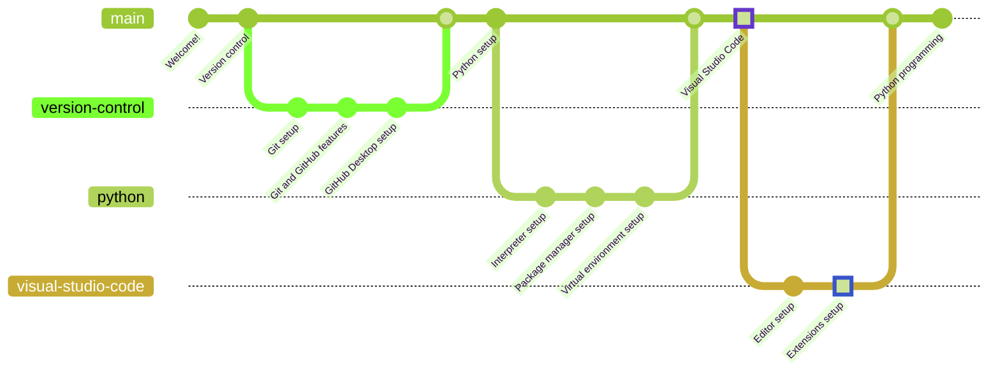

# Visual Studio Code Extensions

> ***Estimated completion time: 5 minutes***

## VSCode Profiles

Since profiles are now supported, there is no need to install all extensions separately, a single profile can be imported with all the required extensions. The link below contains a VSCode profile that you can use for this lesson and even future development, since it contains multiple carefully selected extensions and settings that will make your life easier:

`https://gist.github.com/erlete/43bffa5292ed5474b116a877129da049`

### Import the profile

In order to import the profile, press `Ctrl + Shift + P`, which will open up the command palette. Write *"Profiles: Import Profile..."* and press `Enter`. Now paste the above URL and press enter again. The sidebar will display the import settings. Now click *"Import Profile"*, wait a couple seconds and it will be done!

### Activating the profile

In order to activate the profile, click the gear icon on the lower left side of the screen. Select *"Profiles"* and click on *"Python"*. Now wait for all the extensions to download and load up, which might take a while depending on the quality of your internet connection and the R/W speed of your computer.

If any of the extensions generates a popup or button that says a reload is required, go ahead and click it, or else the extension will not be loaded properly.

## Python Programming

As of now, you are all set to start learning Python programming. You will now understand how lessons are structured through [the introduction guide](/lessons/README.md).

If you want to go back to [the previous chapter](../editor/README.md), go ahead!
